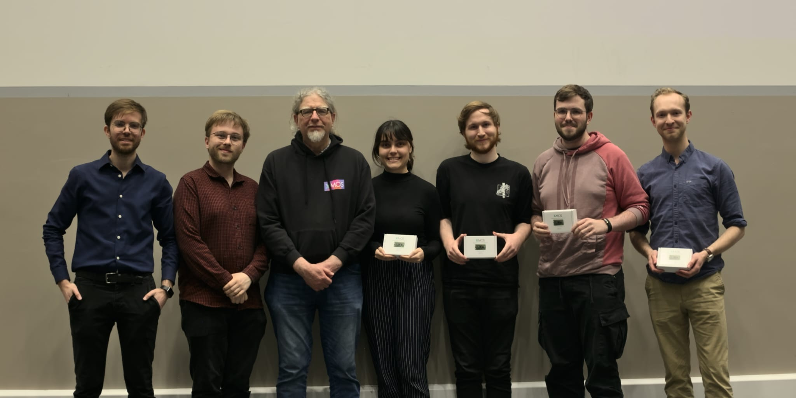

In 2025, I entered Bath Hack with some friends and we won!

Bath Hack is an annual hackathon event held by the University of Bath and the Bath Computer Science Society, with big sponsors and hundreds of particpants. You can find out more about the event here https://hack.bathcs.com/.

TLDR; everyone is given 24 hours to build whatever they like, with various prize tracks on offer.

We were chosen by one of teh sponsors, Xmos, as winnders for the Best Embedded System With our project "Ghostly": a plug-and-play device to turn any touch-screen into a touchless one, through hand and eye-tracking.

<iframe width="560" height="315" src="https://www.youtube.com/embed/mcAFnZiZ43Y?si=meNZivrEYMW7YU_H" title="YouTube video player" frameborder="0" allow="accelerometer; autoplay; clipboard-write; encrypted-media; gyroscope; picture-in-picture; web-share" referrerpolicy="strict-origin-when-cross-origin" allowfullscreen></iframe>

The following is taken from our devpost, in case it ever gets removed, but you can see the full post here if you prefer https://devpost.com/software/ghostly-pa0h56. 

# Inspiration

Touchscreens are everywhere and they are filthy. ATMs, fast-food kiosks, self-service shopping checkouts, the lot.

We have all been through a public pandemic together and yet we all still use these filthy machines.

On top of this, these devices are often not accessible, particularly for individuals with limited motor function like tremors in the hand or weak muscular control.

# What it does

Ghostly converts these filthy machines, to scarily good interaction without ever having to dirty a finger tip.

Simply connect to the Ghostly device on the same network, and move your hand in front of the camera connected to the device.

AI hand tracking models are then used to convert your hand position into a mouse coordinate, and moves the mouse on your device!

You can move your index and thumb together to click, and control your whole computer, kiosk, checkout - whatever, without having to touch it, and with much more control over sensitivity for accessible needs.

# How we built it
he core of our system is a Raspberry-Pi 5 which runs a pre-trained MediaPipe machine learning model to map and track key points on your hand.

We then built an interface layer that takes these points, and outputs a screen coordinate, by calibrating the sensitivity for your screen display size.

These coordinates are then transmitted via web socket to your connected device. A small python program is placed on this machine ahead of time to listen to this socket for where to position your cursor.

We apply some linear interpolation to smooth some of the noise from the model, and use pyautogui to set the mouse position.

We also developed 2 web applications using Vue.js and JavaScript as demonstration applications. We even hosted one of these for you to play with right now! https://jsh4a.github.io/Bath-Hack-2025/

# Challenges we ran into

We originally wanted the Pi to act as a USB device over a USB cable, but it seemed not to be possible on the Pi-5 (or at least it was very difficult). We would like to have had the Pi appear as a HID-Mouse-Device, so no script would be needed on the target. However, we managed to hack together a websocket system to transmit the data instead.

We also wanted to incorporate eye tracking as an alternative mode of input. We got quite far with this, but the model was less accurate than our hand tracking, and in combination with the websocket latency was quite unusable. We decided to abandon it and focus on making our hand tracking even better.

We also wanted to make a case for a raspberry pi with our logo and a hook for the camera cable to be neatly tucked away. We did manage to 3D print this, but it was not quite the right size, so we did not get to house the pi in it.

# Accomplishments that we're proud of

We are ecstatic the plug and play element works seamlessly - you can connect any device and you really can control it without touching it!

We are also very proud of our design, and the breadth of products we managed to make in the time, including 3D printing, selecting and configuring AI models, using an embedded system, hosting a live game anyone can play, and making some really tidy UIs.

We all developed a lot of skills that were new to us!

(We also are proud that 2 / 4 of us went without sleep for the 24-hours!!!)
What we learned

We learnt just how incredible the processing power can be for a device like the raspberry pi, that is relatively low in specs by modern standards. It really is amazing just how much it can do.

We learnt lots about how eye and hand tracking works, and really had to think about making things efficient like using async python!
What's next for Ghostly

Ghostly has real potential as a first iteration for a truly plug-and-play device. With a new micro-controller, we would be able to add this full USB emulation.

With a more powerful controller, we could also increase the accuracy of our model by using something more computationally demanding.

We would also hope to make a more complete case that hides more the internals, and shows off our spooky logo!